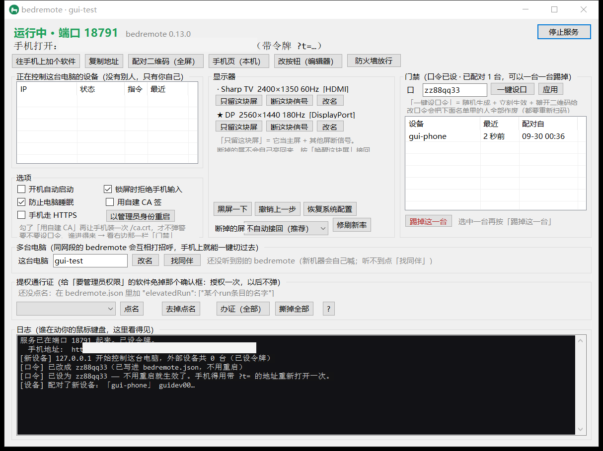
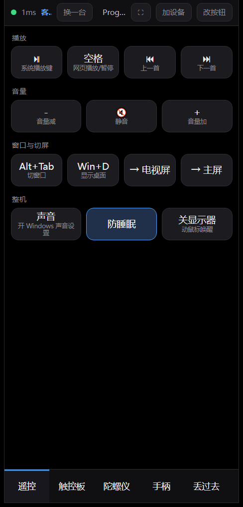
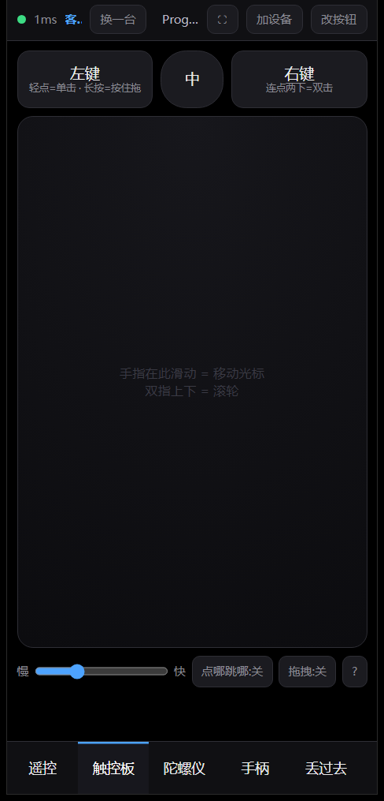
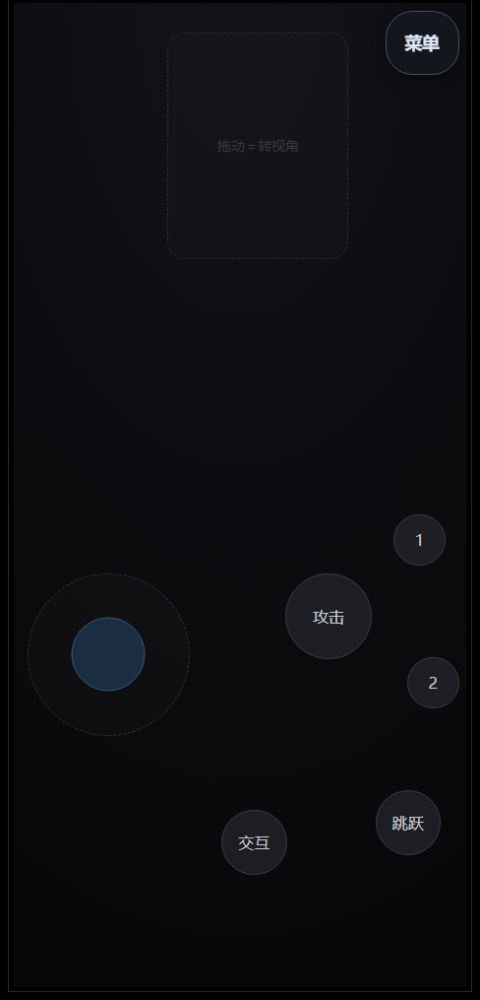
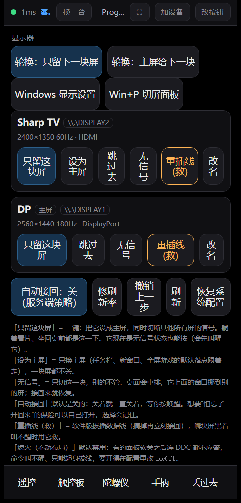
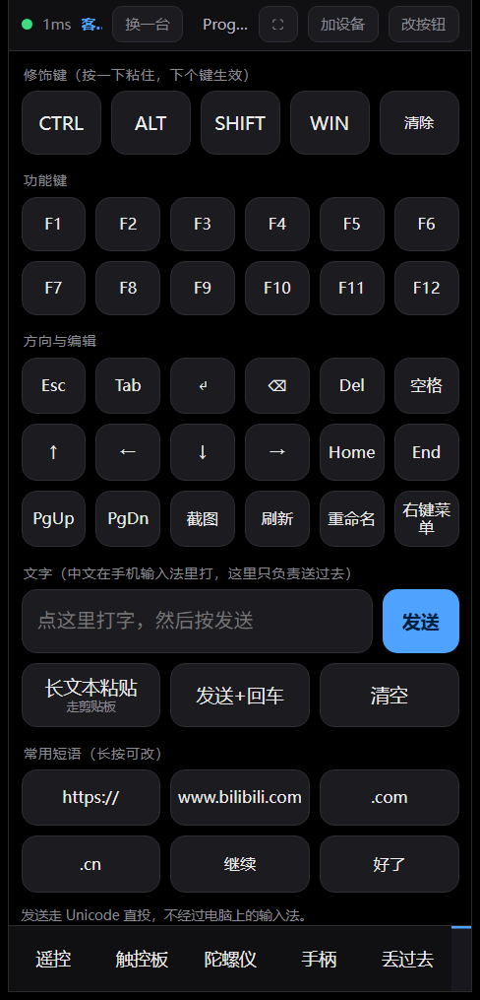

# bedremote

躺在床上，用电脑屋里那块**更大的屏**看片、跑 Agent，用手机当鼠标和键盘。

Lying in bed, watching the big screen in the room while the phone acts as mouse + keyboard.

**English (TL;DR for people who don't read Chinese).** bedremote is a single-file Windows remote-control
server for the "phone as input device" case: video and audio already go to your TV over HDMI, so this project
deliberately has **no screen capture, no encoding, no WebRTC** — the phone only sends commands.
Run `bedremote.exe` (built with the `csc.exe` that ships with Windows: no install, no admin, no NuGet, no runtime
dependencies), open `http://<pc-ip>:8765/` on a phone on the same LAN, and you get a trackpad with dedicated
click keys, a gamepad overlay you can lay out with your fingers, big editable buttons, per-monitor power/source
control, clipboard-based typing of CJK text straight into the focused field, LAN discovery so one phone can hop
between many PCs, and an HTTP endpoint for scripts to push messages to your phone and wait for a yes/no.
It is **not** a remote desktop: if you want the picture on the phone, use Sunshine + Moonlight.
Security warning, said plainly: by default anything on your LAN can control the machine, and there is no login.
Set a `token` if that isn't what you want (see [SECURITY.md](SECURITY.md)).

零安装（只要 Windows 自带的 `csc.exe`）、零管理员、单文件 exe、无任何运行时依赖。
画面和声音走 HDMI，软件只管"手机 → 电脑"这一条指令通道。

```
手机浏览器  ──HTTP──►  bedremote.exe (PC)  ──SendInput──►  Windows
                              │
电脑画面 ──── HDMI 线 ────►  电视 / 大显示器
电脑声音 ──── 同一根 HDMI ─►  电视喇叭
```

**能做的事**：触控板 + 独立点击键、中文直接投进电脑焦点框、大按钮面板（可视化编辑）、
按屏点名控制（谁当主屏 / 让某块屏无信号 / 唤醒 / 救回）、防睡眠、把 Agent 的状态和问题推到手机上并等回答、
常态配对二维码 + 手机自助出码邀人、电脑上看得见此刻有几台设备在控制它。

## 长什么样

电脑上一共就这一个窗口（地址、谁在控制、每块屏、选项、日志都在里面）：



手机上八个页签，这是最常用的四页（截图里"客厅那台"是演示机自己起的名字，地址和电脑名被遮掉了）：

<table><tr>
<td></td>
<td></td>
<td></td>
<td></td>
<td></td>
</tr><tr>
<td align="center">遥控 —— 按钮、分组、页签都能改</td>
<td align="center">触控板 —— 笔记本布局</td>
<td align="center">手柄 —— 沉浸全屏，控件自己摆</td>
<td align="center">屏幕 —— 谁当主屏 / 断信号 / 撤销</td>
<td align="center">打字 —— 中文直接投进电脑焦点框</td>
</tr></table>

## 它**不是**远程桌面

画面和声音由一根 HDMI 线负责，所以这个项目里**没有采集、没有编码、没有 WebRTC、没有帧率与延迟问题**。
手机不进画面，它只是一块会发指令的触摸板。这是它比任何远程桌面都简单一个数量级的原因，也是它延迟要求极低的原因。

适用：播放器、浏览器、翻相册、看文档、给跑在电脑上的 Agent 派活和点头。
不适用：想在手机屏幕上看电脑画面 —— 那请去用 Sunshine + Moonlight。

## 快速开始

1. 双击 `build.cmd`（用系统自带的 `csc.exe` 编译，**不需要装任何东西，不需要管理员**）。
2. 双击 `bedremote.exe`。**一个窗口就是全部**：顶上写着手机要访问的地址（形如 `http://192.168.1.23:8765`），
   旁边是复制地址、配对二维码、谁在控制这台电脑、每块屏的开关、日志。
   关窗口只是缩到托盘（右下角那个绿底小床），托盘右键 → 退出才是真的停服务。
3. 第一次启动时 Windows 防火墙会弹窗，勾上**专用网络**再点**允许访问**。
   （不想点弹窗就按窗口里的「防火墙放行」，或运行一次 `allow-firewall.cmd` —— 都会要一次 UAC。）
4. 按窗口里的**「配对二维码（全屏）」** → 屏幕上出现二维码。手机自带相机对准它，点弹出的链接就进来了，
   **不用在手机上敲地址**。进去以后在浏览器菜单里"添加到主屏幕"，以后就是一个图标。
   （还是想手输的话，地址就写在二维码下面，窗口顶上也有。）

建议顺手做三件事：去路由器后台给这台 PC 绑静态 IP，否则哪天地址就变了；
把窗口里的**「开机自动启动」**勾上（开机直接缩进托盘，不抢你桌面）；
把 Windows 的自动锁屏和自动睡眠关掉，否则锁屏之后手机就控制不了（见下）。

`run.cmd` / `pair.cmd` / `stop.cmd` 还在，但现在只是可选的快捷入口 —— 界面里都有对应按钮。
`bedremote.exe --console` 是原来的无界面行为，脚本、SSH、服务化用法不受影响；
`--port=` / `--token=` 只改参数不切模式，`--tray` 是"界面但启动即缩进托盘"。

## 图形界面里都有什么

一个进程既是服务也是界面，所以界面读的是同进程的状态，不用自己跟自己开 HTTP。

| 区域 | 干什么 |
|---|---|
| 顶上 | 运行中 / 已停止 / 端口被占、版本号、手机地址（设了令牌会写出来） |
| 按钮行 | 复制地址 · 配对二维码（全屏）· 手机页 · 面板编辑器 · 防火墙放行 ·（被占时才有）**接管端口** |
| 正在控制这台电脑的设备 | 只列**外部**设备：IP、页面开没开着、发了多少条指令、最近一条是什么、多久之前 |
| 显示器 | 每块物理屏一行（型号 / 分辨率刷新率 / 接口 / 是否主屏 / 有没有信号），按钮「只留这块屏」+「断这块信号」，无信号的屏变成「切到这块屏」+「唤醒这块屏」；下面还有黑屏一下、撤销上一步、恢复系统配置、修刷新率、断掉的屏多久自动接回 |
| 选项 | 开机自动启动、防止电脑睡眠、锁屏时拒绝手机输入 |
| 日志 | 服务端所有输出都进这里，包括**哪个屏幕动作失败、为什么失败**（不是一个光秃秃的"失败"） |

两个容易踩的地方，程序自己会挡：

- **端口被另一个 bedremote 占着**（升级时最常见）：顶上写"已在别处运行（端口被占）"，
  并长出**「接管端口」**按钮 —— 它只关进程名以 `bedremote` 开头的进程，别的程序占着一律不动它。
- **最后一块亮着的屏断不掉**：按「断这块信号」会被拒绝并说明原因 —— 全黑了就再也点不到「唤醒」，
  只能起身拔线。只想黑一下用「黑屏一下」（动鼠标就回来，也不搬窗口）。

## 配对二维码 `/pair`

`pair.cmd` 干的事就是：服务没起就后台悄悄起，然后打开 `http://127.0.0.1:8765/pair`。
这个页面会把手机该访问的完整地址画成二维码，并且：

- **每个网卡地址一张码**。多网卡（有线 + 无线）时主地址放大，其余列在旁边。
- **每 4 秒自己刷新**。DHCP 重新分配了 IP，码会自己变，不用重开页面。
- **常态挂着**：这一页就是给"以后随时加设备"用的，可以一直开在电视/副屏上；
  同一页下面还显示**这台电脑现在被几台设备控制**（IP、指令数、最近动作、最后一条是什么）。
- **已经连上的手机也能出码**：手机页顶部「加设备」→ 画出当前页面地址的二维码，
  别人扫它就等于访问同一页，不用碰电脑、不用输地址（设了令牌的话码里自带）。
- **右下角实时显示连接数**。手机一打开遥控页，这里就从"等待手机连接"变成"已连接"，
  你躺在床上就知道扫通了没有，不用跑回电脑前看。
- 按 **F** 或点"全屏"，说明文字全部隐掉、二维码撑满整屏 —— **把这个页面开在电视上，
  躺着扫码**。电视浏览器开 `http://<电脑IP>:8765/pair` 即可。
- 令牌模式下：设了 `token` 时，配对页只给本机 `127.0.0.1` 看（局域网访问要带 `?t=令牌`），
  免得配对页把你设的令牌白送给局域网里的陌生设备。二维码里本来就带着令牌，手机扫完即直连。

## 手机界面

页签分两类：前面是你自己摆的配置页签，后面七个是内置的：

- **配置页签** —— 你在 `bedremote.json` 或编辑器里摆的大按钮面板。
- **触控板** —— 笔记本那种布局：**上排 左键 / 中键 / 右键，中间是占满的板面**，底部一条速度 + 两个开关。
  **先把光标移到目标上再按"左键"**，这是躺着手抖时不点歪的关键。连着轻点两下左键＝双击；
  长按左键约 0.4 秒＝进入"按住拖"（另一根手指在板上滑就是拖窗口/拉进度条）。双指上下滑是滚轮，还有个"点哪跳哪"开关。
- **陀螺仪** —— 倾斜手机控光标，不用抬手摩擦屏幕。归零 / 灵敏度 / 死区 / 反X反Y /
  **按住才动** / 点击右击双击 / 屏幕常亮。要 HTTPS 才有数据，见下面《陀螺仪》。
- **手柄** —— 手机当游戏控制器，**进这一页就全屏**（状态条、页签、提示条都收起来）：圆盘走路、任意区域拖视角、
  按钮可以是按键/组合键/鼠标键，模式有点按/按住/切换/连点，控件想加几个加几个。见下面《手机当手柄》。
- **丢过去** —— 手机上看到的链接丢给电脑的浏览器打开（或当搜索词），见下面《丢到电脑》。
- **打字** —— 粘滞修饰键、功能键、方向键，以及一行文字输入。
  中文在**手机自己的输入法**里打，程序把成品字符直接投递给电脑，不经过电脑上的输入法。
- **屏幕** —— 每块物理屏一张卡：型号名、分辨率刷新率接口、是不是主屏、当前有没有信号。
  主按钮 **「只留这块屏」**（它当主屏 + 其他屏断信号），另有「设为主屏 / 跳过去 / 无信号 / 唤醒 / 重插线(救)」，
  顶上还有「轮换：只留下一块屏」「轮换：主屏给下一块」和 **「撤销上一步」**。详见下面《按屏控制显示器》。
  支持 DDC/CI 的屏会多一个「熄灭（不动布局）」按钮 —— **默认禁用**，原因见那节的血的教训。
  电脑换过 IP、插拔过线都不用重开页面，状态自己刷新。
- **Agent** —— 电脑推过来的消息，以及"允许 / 拒绝"和一句话回复。

顶部状态条常显：连接灯、往返延迟、**此刻几台设备在控制这台电脑**、电脑当前前台窗口标题；
右边三个按钮是 全屏 / **加设备**（出邀请二维码）/ 改按钮。

## 丢到电脑（手机 → 电脑开链接）

躺着刷到想看的东西，不想起身回工位：手机页 →「丢过去」→ 粘链接 → 电脑的默认浏览器打开它。

- 手机浏览器**拿不到别的 App 的地址栏**，所以"交出链接"这一下只能人做：Chrome 里 `分享 → 复制链接`，
  回到这一页粘上。HTTPS 之后可以按「读剪贴板」省掉粘贴那一步。
- 不像链接的（比如直接写"异环 什么时候上线"）当**搜索词**处理；`www.xxx.com/...` 自动补 `https://`。
- 最近 8 条记在手机本地（localStorage），点一下重发。
- 服务端只认 `http(s)://` 完整链接、限长、不许空格/引号/管道；`file:`、`javascript:`、
  `\\服务器\共享` 一律拒绝，每一次打开都写日志并回推一条提示到手机上。
  不想要这个功能就 `bedremote.json` 里 `"allowOpen": false`。

**为什么不做"手机投屏"**：移动端浏览器没有 `getDisplayMedia`，手机画面进电脑只有两条路 ——
手机上装原生 App，或者走 adb（那就是 scrcpy）。两条都破掉"两边都不用装东西"这个前提。
真要整屏镜像，在 `run` 白名单里加一条启动 scrcpy 的命令就行，本项目不自己写。

## HTTPS 与陀螺仪

**HTTPS 不是为了加密，是为了手机浏览器肯交底下的传感器。**
`DeviceOrientation` / `DeviceMotion` / `clipboard.readText` / Screen Wake Lock 在非安全上下文里
**事件根本不触发**（不是弹权限框，是拿不到），所以"倾斜控鼠标""一键读剪贴板"必须有它。

- 首启自签一张证书（RSA2048 / SHA256 / 10 年），SAN 里写 `localhost` + `127.0.0.1` + 当前所有局域网 IPv4，
  存在 `%LOCALAPPDATA%\bed-remote\bedremote.pfx`。**换网卡或 DHCP 重新分了 IP 会自动重签**
  （不重签的话 Chrome 直接报错，连"继续访问"的按钮都不给）。
- **同一个端口同时吃 http 和 https**：peek 一个字节，`0x16` 是 TLS 握手，别的当明文。
  所以防火墙规则、老书签、端口号都不用改，`http://` 也照样能用（只是没有传感器）。
- 安卓 Chrome 第一次会警告"不受信任"→ `高级 → 继续访问`，点一次就行。
  **iPhone 不行**：自签要装描述文件并手动信任，很折腾，所以 iOS 用户基本拿不到陀螺仪/剪贴板。
- 界面里的「手机走 HTTPS」复选框改完会**原地重启监听**：旧的 SSE 连接不断（`listener.Stop()` 只关监听套接字），
  手机无感。不想用就关掉，退回纯明文。

**倾斜控鼠标**（手机页 →「陀螺仪」）：相对**归零时的姿态**算偏移，削死区 → 乘灵敏度 → 限速 → 按时间积分成像素，
30Hz 走现成的 `c=move`。默认**按住才动**：不按住的时候倾斜不动光标，换个姿势不会把光标甩飞。
发不出去（限流/断网/锁屏）时位移**还回累加器**，不丢距离。

**为什么不做成"游戏里的手柄"**：软件注入只能变成鼠标键盘，游戏读的是 XInput/RawInput，不吃这套。
要让游戏认它是手柄，要么装虚拟手柄驱动（ViGEmBus，要管理员），要么上硬件 HID
（ESP32-S3 自带 IMU，USB 插上就是一个标准手柄，零驱动、游戏通吃 —— 那是另一个项目）。
本项目里"体感"的用法是给**电脑上的东西直接读姿态**（浏览器游戏、自己写的小玩意），不冒充手柄。

## 手机当手柄（躺着用手玩大屏上的游戏）

「陀螺仪」那节说过：**软件注入变不出游戏手柄**，所以这一档不冒充手柄，它就是把手指变成键盘鼠标。
好处是任何"键鼠能玩"的游戏都能玩，坏处是只支持手柄的游戏（竞速、体育、部分动作游戏）玩不了。

- **左下圆盘** = 走路。推过死区（默认 16%）才有方向，推到 42% 半径才落键，
  推到 82% 自动多按一个"疾跑键"（默认 Shift）。四个方向映射成什么键自己定，默认 `w a s d`。
  斜着推就是两个键一起按 —— 这就是键盘能给的极限了，不是模拟量。
- **右上那块** = 拖动转视角（相对位移，和触控板同一条通道，灵敏度可调、可反 X/Y）。
- **其余按钮** = 任意按键、组合键（修饰键+键）或鼠标左/右/中键，四种模式：
  **点按**（技能、交互）、**按住**（持续射击、走路）、**切换**（按一下一直按着，再按一下才松，适合开关类）、
  **连点**（按住自动重复，间隔可调，适合连发）。
- **多点触控**：左手推、右手连点是常态，所以不是一根手指一个请求 —— 手机每 33ms 发一帧
  "我现在按住哪些键 + 这一帧挪了多少像素"，电脑自己跟上一帧比差分，该松的松、该按的按。
  空闲时一个包都不发。
- **改布局**：右上角那个淡到几乎看不见的 `⋯` → 「编辑布局」，控件虚线框出来，手指拖着摆位置；
  点一个控件，底部滑出**属性面板**：名字、动作、键位（旁边有「抓键」，点一下用软键盘抓，不用手打）、
  模式、连点间隔、大小、高、透明度、圆/方、复制、删除，改完立刻生效。
  「＋按钮 / ＋摇杆 / ＋十字键 / ＋视角区」随便加 —— 想要两个摇杆就两个摇杆，想要两块视角区就两块。
  「存到电脑」写进 `bedremote.json` 的 `gamepad` 段。位置存的是**比例**（0..1），大小按画布短边算，
  所以换手机、换横竖屏、换到电视上都摆得开：默认那套布局在竖屏/横屏/平板/电视/超宽/方屏下都不重叠，
  拖到边上就正好贴边（存的位置和画出来的位置是同一份数，不会出现"看着钉在角上、拖不动"），
  画布变小了会自动把控件收回界内。0.11.1 之前存的布局第一次打开会**重排一次**出厂控件的位置尺寸
  —— 只动几何，你改过的名字、键位、模式、透明度和自己加的控件都不碰。

**延迟可以量**：手柄菜单里点「测延迟」，或者进这一页让它每 2 秒自己测 —— 手机发一个自己的时间戳，
电脑原样从那条长连接退回来，手机用同一个钟算差值，**不需要两边对表**。显示的是"本次/平均/最差 + 其中电脑处理几毫秒"。
它走的路和真正发按键完全一样（上行 → 分发 → SSE 下行），所以约等于"我按下到电脑知道"那一段，不含屏幕刷新。

**预设可以存好几套**：菜单最上面一排是预设名字（默认 / 动作 / 策略…随便起），点一下整套换掉。
「＋新预设」可以选择把当前这套复制进去还是从默认开始，还能改名、删掉。换游戏不用再重摆。

**布局跟着人走**：整套布局带一个"最后改动时刻"，手机连上任何一台电脑就比一次——**谁新谁赢**。
所以你在 7 号机上摆好的一套，走到 12 号机点一下就推过去了。（代价：两部手机共用一台电脑时会互相覆盖。）

**为什么必须有看门狗**：手指按住时手机锁屏、切后台、WiFi 抖一下，"抬手"那个事件就丢了，
游戏里角色会一直朝前跑。所以电脑这边给每台设备记着"它现在按住了什么"，
**900ms 没收到新帧就全部松开**，锁屏/UAC 立刻松，切页签和关页面时手机还会主动发一次 `c=release`。
日志里会看到「[手柄] 松开了 N 个按住的键」。

**还有一条限制要提前知道**：注入进不去高权限窗口和锁屏界面（Windows 的规矩），
所以"以管理员身份运行"的游戏要么把 bedremote 也提权跑（见《提权通行证》），要么手机上会收到一条说明。

## 装成 App，让安卓分享面板里出现 bedremote

「丢过去」还差最后一步：从任何 App 里点分享，电脑就直接打开，连"复制链接再粘贴"都省。
这一步是 PWA 的 Web Share Target，**它要求证书被手机信任** —— 裸自签不够（绕过警告页
只给安全上下文，不给"信任"，而 Chrome 注册 Service Worker 要的是后者）。所以：

1. 电脑：界面里勾**「用自建 CA 签」**（或 `bedremote.json` 里 `"ca": true`）。它会现生成一张 10 年根 CA，
   再签一张 2 年的叶子；`http://<电脑IP>:8765/ca.crt` 就是那张根证书的下载入口。
2. 手机：浏览器打开上面那个地址下载，然后 `设置 → 安全 → 加密与凭据 → 安装证书 → CA 证书` 装上。
   （安卓 Chrome 认用户装的 CA；iPhone 要装描述文件并手动信任，很折腾，所以 iOS 走不通这条路。）
3. 之后用 `https://<电脑IP>:8765` 进来 —— 不再弹警告，浏览器菜单里**「添加到主屏幕」**能装成 App。
4. 装成 App 后，任何 App 的分享面板里会出现 `bedremote`：选它 → 分享的内容里的链接直接在电脑上打开
   （`/share` 从 `url`/`text`/`title` 三段里挑，和「丢过去」同一套校验），然后回到 App 首页报一句结果。

不想装根证书也完全能用：`ca:false` 就是裸自签，传感器和剪贴板照常（它们只看安全上下文），
只是装不了 App。

**上面这几步不用你自己记**：手机页顶部会自己诊断出一条窄条，只说"现在缺什么 + 点哪个按钮"：

- 你用 `http://` 打开的 → 它给一个「用 https 打开」（陀螺仪和装 App 都卡在这一格）。
- `https://` 但证书没被信任 → 给「下载根证书」和「怎么装？」（后者弹一段按机型分的步骤）。
- 证书已经信任了（用"Service Worker 注册成功"当判据，这是唯一能自证的信号）→ 出现**「装到桌面」**按钮，
  点了就走 Chrome 的安装流程。已经装成 App 或者从电脑本机打开时，这条不显示。

## 多台电脑（一个网段里几十台）

这工具的定位是"**人不在机器前面**"：屋里一排机器，你手上那部手机就是它们的键盘鼠标。
所以"控两台"不该要求你记两个 IP。

- **机器自己打招呼**：每台 bedremote 起来会在局域网里用 UDP 喊一声（我是谁、哪个地址、几个屏、开没开 https），
  之后每 5 秒一次心跳。互相听得到的就成了"同伴"。浏览器发不了 UDP，所以手机不掺和这件事 ——
  它只问**当前这台**"你认识谁"（`c=mates`），拿到的就是整份名单。
- **手机上「换一台」**：顶部那行蓝字就是这台电脑的名字，旁边「换一台」点开名单，
  点一下就跳过去（重新加载，局域网里一百来毫秒）。名单里还并上**本机记过的地址**，
  所以某台刚开机、或者广播被交换机挡住，你以前连过它也还能一键回去（标成"没应答"）。
- **广播不通时的退路**：「找同伴」（界面）/「重新找」（手机）会往本机所在那一段的 254 个地址
  **单播**问一圈（`c=scan`）。只有真的 bedremote 会答这个包，所以比扫端口准，也不会惊动别的东西。
- **三类名字都能改，不用碰 JSON**：
  - **机器名** —— 默认是 Windows 电脑名，界面里「改名」或手机上「改这台的名称」都行。
    它出现在窗口标题、配对页、手机顶部和名单里。
  - **每块屏的别名** —— 默认显示显示器自己的型号名（`ESWIN` 这种），改成「左边竖屏」「床头那台」。
    按**屏幕的稳定 UID** 存，所以换接口、改分辨率之后不会张冠李戴。电脑界面每行一个「改名」，手机屏幕页每张卡一个。
  - **面板/按钮名** —— 手机上点顶部「改按钮」就是那个编辑器（这一页现在做了手机排版，窄屏会竖着堆）。
- **「把面板推给它们」**：在机器名单里点一下，把这台的面板（页签和按钮）覆盖到名单里所有同伴。
  只动对方的 `panels` 那一段，端口/令牌/白名单/手柄布局都不碰；对方机器上会留一行日志。
  目标**必须来自发现名单**，不能随手给一个 URL —— 免得这条命令变成"拿本机令牌去写陌生服务器"。

前提说清楚：这些机器得**互相能连**（同一个二层网段最省事）。跨 VLAN、访客网络、开了 AP 隔离的，
广播和单播都过不去，那就只能手动输地址。另外第一次启动那个 Windows 防火墙弹窗，
**两个网络类型都勾上** —— 发现走的是 UDP，只放行了 TCP 的话名单永远是空的。

还有一条更要紧的：**这套东西默认不认人**。几十台的网段里，任何能连上这些端口的设备都能动那台机器的鼠标键盘，
也能改它的名字和面板。家里无所谓，公司里请先设 `token`（见《安全说明》）。

## 按屏控制显示器（无信号 / 熄灭 / 救）

"手机页 → 屏幕"那一页是干这个的。它认**物理屏**，不是认 Windows 的桌面区域：每块屏一张卡，
型号名、分辨率刷新率、接口、是不是主屏、当前有没有信号都写在上面。

**主按钮是「只留这块屏」** —— 一键 = 把它设成主屏 + 切断其他所有屏的信号。
躺着看片按下电视那张、坐回桌前按下主屏那张，就这两下。它现在是无信号状态也能按（会先叫醒它、再切主屏、再关别人）。
按错了或想反悔，顶上的「撤销上一步」回到上一个显示配置。

其余动作是原语，副作用各不相同，**别混**：

| 动作 | 怎么做的 | 桌面布局 | 能不能一定叫回来 |
|---|---|---|---|
| **只留这块屏** | 它当主屏（任务栏/新窗口/全屏游戏默认落点都挪过去）+ 其他屏无信号 | 会重排 | **能**，反方向再按一次，或「撤销上一步」 |
| **设为主屏** | 只改桌面坐标原点（(0,0) 在哪块屏上，哪块就是主屏），一块屏都不关 | 原点变，窗口整体位移 | **能**，撤销即可 |
| **无信号** | `SetDisplayConfig` 把这块屏从显示配置里摘掉（等于拔了它的线） | 会重排，它上面的窗口挪到别的屏 | **能**。接回就是重新驱动它，面板一收到信号就醒 |
| **熄灭** | DDC/CI 命令面板自己进待机（`VCP 0xD6=4`） | **不动**，窗口不挪 | **不一定**。见下面那条血的教训 |
| **重插线（救）** | 摘掉这块屏再立刻接回，强制重新握一次手 | 会重排两次 | 这是"面板已经不应答"时的软件救命稻草 |
| **撤销上一步** | 把动之前存下的"活着的 path + mode 表"原样应用回去 | 回到上一步 | 快照只活在进程里，服务重启后就没有了 |

**血的教训（本机实测，不是理论）：** DDC 的"熄灭"在有些面板上是**单程票**——主屏（ESWIN 面板）
接受了 `0xD6=04` 之后**连 DDC 通道一起断了**，再发 `0xD6=01` 叫它，命令递不进去，`SetVCPFeature`
照样返回成功（它只说"命令发出去了"）。结果就是屏幕黑着、软件怎么叫都不醒，**只能起身拔数据线重插**。
所以：

- `bedremote.json` 里的 **`ddcOff` 默认为 `false`**，也就是"熄灭"按钮默认不出现。
  想用就自己打开，并且知道它可能让你起身一次。
- 就算打开了，DDC 熄灭也**一律带兜底**：默认 20 秒后自动叫醒，叫不醒就自动"重插线"。
- DDC 唤醒之后会**回读面板活性**（不是看返回值，是看 0x10 还读不读得到）；不应答立刻自动重插线。
- 电视（Sharp）在 HDMI 下**完全不支持 DDC**（所有 VCP 读回 `ERROR_GEN_FAILURE`），
  所以它只有"无信号"那一条路，也正因如此它反而更安全。

写这块代码时踩到的三个坑（都在 `src/Display.cs` 注释里）：

1. **别拿 `targetInfo.id` 当屏的身份**：同一块屏在"扩展"和"克隆"下 id 会变（实测电视扩展时
   `268`，被克隆后变 `50331916`）。要用设备路径里的 `UID`（EDID+UID），屏不变它就不变。
2. **唤醒时别挑"已被别的活跃屏占用的 source"**：那会变成**克隆**（两块屏同一画面、帧率被拉齐）。
   正确顺序是先试数据库里存的布局、再试空闲 source、最后整组扩展；而且**每次动完必须回读校验**，
   不满足预期就回滚 —— 我就是因为没校验，把主屏和电视搞成了克隆。
3. **DDC 读有约 10% 随机丢包**（同一块面板，三种场景实测 6/6、5/6、3/3），单次失败不算数，
   要重试几次再判"不支持"，否则手机上的按钮会忽隐忽现。另外 `GetPhysicalMonitorsFromHMONITOR`
   拿到的句柄**必须** `DestroyPhysicalMonitors` 还回去。

`tools\monprobe.cs` 是一个只读侦察工具：列出所有显示 path（含插着但没驱动的）、
每块屏的 DDC 能力串和 VCP 值。换新显示器/新电视时先跑它，就知道这台机支持哪些玩法。
编译：`csc.exe -nologo -target:exe -platform:x64 -r:System.Windows.Forms.dll -out:monprobe.exe tools\monprobe.cs`

## 改按钮

电脑上打开 `http://127.0.0.1:8765/edit`，可视化增删页签、分组、按钮，
每行末尾有个"试"字按钮可以立刻验证这个动作有没有生效。保存后手机上已打开的页面会**自动刷新**，不用重开。

不想用编辑器就直接改 `bedremote.json` 的 `panels` 段，或点编辑器右上角"JSON 模式"。

按钮支持的 `act`：

| act | 需要的字段 | 作用 |
|---|---|---|
| `key` | `key` | 按一个键。`a`…`z`、`0`…`9`、`enter` `esc` `tab` `space` `backspace` `del` `up/down/left/right` `home` `end` `pgup` `pgdn` `win` `menu` `printscreen` `f1`–`f12`，以及 `playpause` `nexttrack` `prevtrack` `mute` `volup` `voldown` |
| `combo` | `key`, `mods` | 组合键。`mods` 只认 `ctrl` `alt` `shift` `win`，多个用 `+` 连，如 `ctrl+shift` |
| `text` | `text` | 把一段文字投进电脑当前焦点框（Unicode 直投） |
| `paste` | `text` | 长文本走剪贴板 + Ctrl+V，**用完还原你原来的剪贴板** |
| `screen` | `n` | 光标跳到某块屏的中心。`tv` = 非主屏，或 `0` / `1` |
| `power` | — | 关闭显示器（动一下鼠标就回来） |
| `awake` | — | 切换"防睡眠" |
| `run` | `name` | 运行 `bedremote.json` 里 `run` 段**白名单**中写好的命令名 |
| `reload` / `tab` / `clearmods` | `tab` 需 `n` | 纯手机端行为 |

每个按钮还能带 `label` `sub`（副标题）`confirm`（点击前弹确认）`class`。

## 提权通行证（那些"要管理员权限"的软件）

有些软件一启动，Windows 就弹「要用管理员身份运行吗」。那个框是**高权限窗口**，
普通权限的 bedremote 送不进输入 —— 于是手机上一点这种软件，远程当场"什么都点不动"，
直到有人去电脑前把它点掉。通行证就是为这个场景做的：

| 做法 | 效果 | 代价 |
|---|---|---|
| **去掉那个软件的勾选**（推荐先试这个） | 那个软件不再要管理员，框根本不弹 | 只治你这一个软件，且它可能真的需要权限 |
| **通行证**（本项目） | 授权一次，以后从手机上启动它**不弹框**、以管理员身份起来 | 这是一次**定向的 UAC 绕过**，见 SECURITY.md |
| **bedremote 自己提权**（界面里「以管理员身份重启」） | 所有这类软件都不弹框，而且你还能远程点那个框 | 整个远程工具带管理员权限，手机丢了事就大了 |

**怎么加一个软件（推荐走向导）**：电脑上打开 bedremote 窗口 → 工具栏第一个按钮**「往手机上加个软件」** →
从列表里点一个（列表就是**现在开着、有窗口的程序**，不用记路径；也可以把 exe / 快捷方式拖进窗口，或「浏览」选）→
点**「加到手机上」**。它自己写白名单、自己热加载（**不用重启**）、自己在手机上长出这个按钮；
要是这个软件要管理员权限（程序自己读它的 manifest 和兼容性勾选判断），就顺手把证办了 ——
**这时弹的 UAC 要你点「是」**，这一下机器代不了劳。`bedremote.exe --wizard` 可以直接把向导摊开。

只想单独办证（软件已经在白名单里）：窗口最底下那行「提权通行证」→ 下拉选它 → 「点名」→「办证（全部）」→ 点「是」。
想手工控制：`"run": { "名字": "start \"C:\\路径\\x.exe\"" }`，要免弹框再加 `"elevatedRun": [ "名字" ]`，
重启后用界面办证，手机按钮用 `/edit` 加（动作选 `run`，名字填同一个）。

实现是 Windows 自带的机制：注册一个"以最高权限运行"、主体为 `BUILTIN\Users` 组的计划任务，
于是普通权限进程也能 `schtasks /run` 触发它。任务名叫 `bedremote-run-1/2/...`，
序号记在 `%LOCALAPPDATA%\bed-remote\passes.map`（改名不会连累别的证）。
**「撕掉全部」**随时能撤销；命令改过的条目会标成"过时"并拒绝使用旧证，重办一次即可。

没办证也能用：照常启动，只是会弹框 —— 但手机会立刻收到一条说明，告诉你为什么点不动、怎么办一次就好。

## 让脚本把话推到手机上

这是自造版相对现成 App 唯一真正值钱的地方：电视上你在看电影，读不了 Agent 的状态，
所以把"它在干什么 / 要不要你点个头"推到手机那一小块屏上。

```bat
curl "http://127.0.0.1:8765/notify?text=编译完了"

rem 问一句并阻塞等手机上回答（回答会同时写进 %LOCALAPPDATA%\bed-remote\last_reply.txt）
curl "http://127.0.0.1:8765/ask?text=要现在下载吗"
```

`/notify` 只接受来自本机的请求，不需要令牌；`/ask` 本机或带令牌都行。

## 切音频输出（就走 Windows 自己的面板）

手机"遥控"页的**「声音」**按钮就是白名单里的一条 `run`：

```json
"run": { "声音设置": "start ms-settings:sound" }
```

按下 → 电脑上出 Windows 的声音设置页 → 用手机触控板点下一个输出设备。就这样。

**为什么不做成"一键轮换默认设备"：** Windows 没有公开 API 能设默认音频输出，所有工具用的都是
未公开的 `IPolicyConfig`（IID 和 vtable 顺序都得照抄别人的实现，前面还压着 10 个方法）。
为了省两下点击去引这种接口不值当，而且它一炸炸的是常驻服务。所以这个项目把"打开面板"交给
`run` 白名单 —— 你要换别的命令（开播放器、开某个页面）自己加一行就行。

## HTTP 接口

| | |
|---|---|
| `GET /` | 手机页 |
| `GET /edit` | 面板编辑器 |
| `GET /pair` | 配对二维码页（见上） |
| `GET /addr` | 给配对页用：`{"port":..,"token":..,"online":..,"devs":..,"https":..,"peers":[..],"ips":[..]}` |
| `GET /vendor/*` | 只放行 `www\vendor\` 下的 js/css，挡 `..` |
| `GET /panel` · `POST /panel/save` | 读 / 写面板定义 |
| `GET /gamepad` · `POST /gamepad/save` | 读 / 写「手柄」布局（`gamepad` 段）。电脑只是替手机存着，不解释内容；按钮数上限 64 |
| `GET /cmd?c=mates` | 这台电脑知道的同伴名单：`[{id,name,ip,port,mon,https,ver,seen,self}]`（自己永远在第一位） |
| `GET /cmd?c=scan` | 往本机所在那一段的 254 个地址单播问一圈（约 1.3 秒），回来的一起进名单；广播被挡时用这个 |
| `GET /cmd?c=name&n=<名字>` | 给这台电脑起名字（留空 = 回到 Windows 电脑名），写进 `bedremote.json` 的 `name` |
| `GET /cmd?c=srename&mt=<uid>&n=<名字>` | 给某块屏起别名（按 UID 存，留空 = 回到型号名），写进 `screenNames` |
| `GET /cmd?c=push&to=all\|ip:port,..` | 把本机 `panels` 覆盖到名单里的同伴（只动对方 panels 一段）。目标不在名单里就拒绝 |
| `GET /cmd?c=frame&keys=w,a&mb=left&dx=6&dy=-2` | 手柄的一帧：`keys`/`mb` 是**此刻按住**的全集，电脑自己跟上一帧差分（丢帧自愈）；`dx`/`dy` 是这一帧的视角位移（单次夹 ±400）。按 IP 记账，900ms 没新帧自动全松 |
| `GET /cmd?c=release` | 这台设备立刻松手（手机切页签/关页面时用 beacon 发） |
| `GET /cmd?c=lag&t0=<手机自己的时间戳>` | 延迟探针：不注入任何东西，把 `t0` 原样从 SSE 退回（`{"e":"lag","t0":..,"srv":毫秒}`），手机用同一个钟算差值 |
| `GET /cmd?c=<动作>&...` | 所有控制指令 |
| `GET /cmd?c=open&u=<链接>` | 「丢到电脑」：用默认浏览器打开这个链接。只认 `http(s)://`、限 2000 字符、不许空格/引号/管道；`allowOpen:false` 可整条关掉；每次打开都写日志 |
| `GET /manifest.webmanifest` | PWA 清单（代码生成，`start_url` 和分享动作里带上令牌）。设了令牌时要带 `?t=` 才能取 |
| `GET /share?url=&text=&title=` | 安卓分享面板的落点：从这三段里挑出链接走同一套 `open` 校验，然后 302 回 `/?shared=<结果>` |
| `GET /ca.crt` | 自建 CA 模式下的根证书（PEM），给手机下载装上；裸自签模式下返回一段说明 |
| `GET /cmd?c=mons` | 列每块物理屏：`{uid,name,dev,act,clone,prim,w,h,tech,hz,ddc}` + 顶上的 `ddcOff` |
| `GET /cmd?c=only&mt=<uid>` | 一键"只留这块屏"：它当主屏 + 其他屏全部无信号（没在工作的屏会先被唤醒） |
| `GET /cmd?c=primary&mt=<uid>` | 只改主屏，一块屏都不关 |
| `GET /cmd?c=cyclep` / `c=cycleo` | 不点名，"换下一块"：`cyclep` 只把主屏交给下一块；`cycleo` 只留下一块（切主屏 + 关掉其他）。环按 uid 排，两块屏时是花架子，三块以上才好用 |
| `GET /cmd?c=undo` | 回到上一步的显示配置（"只留这块屏"/"设为主屏"之前） |
| `GET /cmd?c=blank&mt=<uid>[&sec=N]` | 让某块屏**无信号**（拓扑法）；`sec` 秒后自动接回 |
| `GET /cmd?c=wake&mt=<uid>` | 接回某块屏 |
| `GET /cmd?c=rescue&mt=<uid>` | 软件版"拔线重插"：摘掉再立刻接回 |
| `GET /cmd?c=blank&mt=<uid>&m=ddc` | DDC/CI 熄灭（**默认禁用**，见上；`m=ddc` 不带 `sec` 也会自动兜底 20 秒） |
| `GET /cmd?c=ddcdbg&mt=<uid>` | DDC 诊断：每一步的返回值原样吐出来，排查"为什么控制不了这块屏" |
| `GET /events` | SSE 推送：前台窗口标题、消息、提问、面板已变更、锁屏提示、屏幕状态变更 `{"e":"mons"}`、设备台账变更 `{"e":"peers"}` |
| `GET /status` | 屏幕数、光标位置、前台窗口、是否锁屏、运行时长、`cfg`/`cfgErr`（配置有没有解析失败）、`runCount`、`devs` |
| `GET /notify?text=` · `GET /ask?text=` | 见上 |
| `GET /health` | 活着就回 `ok` |

## 配置

**想直接抄一份能跑的：仓库根目录的 [`bedremote.example.json`](bedremote.example.json)** ——
里面每个键都是服务端真读的（包括界面和「提权通行证」那些），把它复制成 `bedremote.json` 就能起。

`bedremote.json`（首次运行自动生成，删掉就回到内置默认）：

```json
{ "port": 8765, "name": "7号机", "token": "", "keepAwake": true, "denyWhenLocked": true,
  "ddcOff": false, "https": true, "ca": false, "allowOpen": true,
  "screenNames": { "512": "左边竖屏" },
  "run": { "mpv": "mpv --loop=inf D:\\movie.mkv" },
  "elevatedRun": [ "mpv" ],
  "gamepad": { "active": "默认", "ts": 1790000000000, "profiles": { "默认": {
    "widgets": [
      { "id": "stick1", "kind": "stick", "x": 0.04, "y": 0.55, "w": 0.39, "h": 0.39,
        "keys": ["w", "a", "s", "d"], "run": "shift", "runAt": 0.82, "dead": 0.16 },
      { "id": "look1", "kind": "look", "x": 0.44, "y": 0.03, "w": 0.54, "h": 0.58, "sens": 1.5 },
      { "id": "b1", "kind": "btn", "x": 0.62, "y": 0.70, "w": 0.24, "h": 0.24, "round": 1,
        "label": "攻击", "act": "mb", "k": "left", "mode": "hold" },
      { "id": "b2", "kind": "btn", "x": 0.50, "y": 0.88, "w": 0.17, "h": 0.17, "round": 1,
        "label": "格挡", "act": "key", "k": "q", "mode": "toggle" }
    ],
    "opt": { "hz": 33 }
  } } },
  "panels": { "tabs": [ ... ] } }
```

`token` 非空时，所有地址必须带 `?t=<token>`。
`ddcOff` 打开后手机"屏幕"页才会出现"熄灭（不动布局）"按钮 —— 先读上面那个**血的教训**再决定。
`https` 关掉就退回纯明文（手机的陀螺仪/剪贴板/屏幕常亮会一起没了）；
`allowOpen` 关掉就禁掉「丢过去」（电脑不再因为手机发来的链接开浏览器）。
`gamepad` 是手机「手柄」页签的布局集，由手机自己写（「存到电脑」或者手机那份比电脑新时自动同步），
电脑只负责存和发回来。`profiles` 是多套预设、`active` 是当前用的那套、`ts` 是"最后真改动"的时刻（谁新谁赢，
所以布局跟着人走，不用每台机器重摆）。`ver` 是布局的**几何版本号**：老存档（没这个字段）第一次读进来时
会重排一次出厂控件的位置尺寸，只动几何，你改过的名字/键位/模式/透明度和自己加的控件都不动。
坐标全是 0..1 的比例，`x/y` 按画布宽/高算、`w/h` 按 min(宽,高) 算
（所以正方形在横竖屏下都还是正方形）。老形状（顶层 `widgets`，或更早的 `stick`/`look`/`buttons` 三段）
手机读到时会自动迁成新格式。手动改也行，改完手机上点「读电脑」。

**改完配置不知道程序认不认？** 配置读失败时服务端会**悄悄退回内置默认** —— 界面一切正常，只是你的改动没生效，
从手机上看根本发现不了。所以有个专门的小工具验它：

```
C:\Windows\Microsoft.NET\Framework64\v4.0.30319\csc.exe -nologo -codepage:65001 -platform:x64 ^
  -r:System.Windows.Forms.dll -r:System.Drawing.dll -main:CfgProbe -out:cfgprobe.exe ^
  src\Apps.cs src\Config.cs src\Display.cs src\Gui.cs src\Mates.cs src\Passes.cs src\Tls.cs ^
  src\Wizard.cs src\BedRemote.cs tools\cfgprobe.cs

cfgprobe.exe C:\路径\bedremote所在目录
```

它把那份 json 交给**真的 `Config.Load`** 读一遍，打印读到了什么（端口/页签数/按钮数/手柄几套预设），
还会逐个检查按钮的 `act` 是不是服务端认识的动作 —— 写错一个字母就是"点了没反应"，这个能当场抓出来。
退出码 0 = 读通了。

## 安全说明（认真看）

不设令牌时，**局域网里任何设备打开那个地址就能控制你的鼠标键盘**。
默认选了省事这边，因为家里就那几个设备；介意就填 `token`。
`run` 白名单是故意做成白名单的：手机永远传不过去一条任意命令行。
这个程序不做鉴权以外的任何防护，别把它放到公网或访客网络上。

正因为默认不设令牌，程序至少让你**看得见是谁在动**：

- 服务端按 IP 记台账（第一次见到某台设备会往控制台打一行 `[新设备] x.x.x.x 开始控制这台电脑…`），
  记它发了多少条指令、最后一条是什么、页面还开着没有。
- 电脑上的配对页 `/pair` 常态显示这张表 +「这台电脑现在被几台设备控制」的大数字。
  **本机自己的浏览器不算外部设备**（它认 loopback 和自己网卡上的 IP），所以数字就是"别人"。
- 手机页顶部显示「N 台在控制」，点「加设备」能看到具体是哪几个 IP。
- 数据接口：`GET /addr` 里带 `devs` 和 `peers[]`，另外 SSE 会推 `{"e":"peers",...}`。

### 邀请别的设备（不用碰电脑）

已经连上的手机点「加设备」就出自己的二维码 —— 那是**当前页面地址**画成的码，设了令牌的话码里带着令牌，
后来的人扫一下就直接进来，不用扫码的人碰电脑、也不用手输地址。
**这个码等于把你的鼠标键盘交出去**，所以只在信任的人之间传；对外请设 `token`。

## 已知限制

- 只能注进**你自己登录的那个桌面会话**。锁屏、Ctrl+Alt+Del、UAC 弹窗期间系统会丢掉注入 ——
  程序用"LogonUI / Consent 进程在不在"来判断并往手机上提示，但这是近似判据。
- 注不进**以管理员身份运行**的程序（Windows UIPI 限制），除非 bedremote 自己也提权跑。
- **UAC「要用管理员身份运行吗」那个框，手机点不动** —— 它是高权限窗口，普通权限进程送进去的输入会被丢掉。
  表现就是"手机上点开某个要提权的软件，远程突然什么都没了"。程序分得清这是 UAC 还是锁屏
  （看 `Consent.exe` 还是 `LogonUI.exe`），弹出来的那一刻就把该怎么做推到手机上，红条会留 20 秒。
  两个出路：**去电脑前点掉**；或者点界面里的**「以管理员身份重启」**—— bedremote 提权之后
  既能操作那个确认框，而且它启动的高权限程序根本不会再弹框。
- 走 RawInput 独占的设备读取的游戏可能不吃软件注入的鼠标。真要打游戏请上硬件 HID（ESP32/CH9329），这个项目不做。
- 手机浏览器在非 https 下拿不到 Screen Wake Lock，所以屏幕仍会按手机自己的超时熄灭。
- HTTPS 是**自签**的：安卓 Chrome 点一次"继续访问"就行，**iPhone 要装描述文件才不报错**，
  所以 iOS 实际上拿不到陀螺仪/剪贴板。另外证书存在当前用户的 `LocalAppData` 里，
  换用户跑会重新签一张。
- SSE 断线期间推的消息**不会补发**，手机回到前台要自己刷新一下。
- 「陀螺仪」的映射数学是在桌面浏览器上喂合成事件验的（死区、限速、按住才动、丢了不补都过了），
  **真机手感没验过** —— 灵敏度默认 130 px/s/度、限速 1600 px/s，觉得飘就调 ±，或直接改用触控板。
- 设备台账按 **IP** 记账：同一台手机换了 DHCP 租约会被当成"新设备"；反过来同一台路由器后面的
  多台设备也各有 IP（局域网里是正常的），但它不区分"这台 iPhone 和上次那台是不是同一部"。
- **`c=power`（一次关掉所有显示器）在本机从未实测** —— 测它会把正在用的机器打断，
  所以它的行为只有文档描述，没有验证记录。同理，"电视显示无信号"这件事我只在软件侧确认
  （该屏从显示配置里消失、`act:false`），没人拿眼睛对着电视确认过。
- 托盘/窗口图标是运行时用 GDI+ 画的位图（为了守住"一个 exe、零资源文件"），不是真 `.ico`；
  所以**桌面快捷方式的图标还是系统默认那个**，只有窗口和托盘里是小床。
- 没有 macOS/Linux 版（服务端和界面都是 Windows 专属，手机页跨平台）。
- **多机的发现只在同一个二层网段里有效**：跨 VLAN、跨路由、开了 AP 隔离的收不到广播；
  退路是「找同伴」的单播问一圈（仍要求两台之间 UDP 能通），再不行就是手动输地址。
  名单是"尽力而为"的视图，不是权威清单 —— 某台没进名单不影响你直接开它的地址。
- **发现走 UDP 广播，第一次启动那个防火墙弹窗如果只放行了 TCP，名单会永远是空的。**
  排查顺序：`/cmd?c=mates` 有没有别的条目 → 「找同伴」→ 还不行就是防火墙或网段隔离。
- README 还没有截图。想加的话：手机页四个页签 + 电脑配对页 + 桌面窗口各一张，丢进 `docs/` 并在下面这节引上。
  （截图前记得把地址里的局域网 IP 换掉。）

## 构建

```
build.ps1     真正的编译脚本（build.cmd 只是它的一层壳；`-Out 别的名字.exe` 可以编出测试用的第二份）
src\Config.cs      JSON 读写 + 配置加载 + 界面改开关用的 SetBool/SetNum
src\BedRemote.cs   服务 + SendInput 注入 + 给界面用的外壳（日志汇聚、启停、接管端口）
src\Display.cs     按屏控制显示器：拓扑法（无信号/唤醒/重插线）+ DDC/CI
src\Gui.cs         窗口 + 托盘（WinForms，无设计器、无资源文件，图标是运行时画的）
src\Tls.cs         自签证书（SAN 带当前局域网 IP）+ 同端口 http/https 分流
src\Passes.cs      提权通行证：计划任务的注册 / 查询 / 触发 / 撕掉
src\Apps.cs        认程序：要不要管理员（内嵌 manifest + 兼容性勾选）、列开着的窗口、解 .lnk
src\Wizard.cs      「往手机上加个软件」向导：写白名单 + 加手机按钮 + 热加载 + 顺手办证
src\Mates.cs       多机发现：UDP 心跳（有限广播 + 每网卡定向广播）、名单、过期、单播问一圈
www\phone.html     手机端界面（配置驱动 + 内置触控板/陀螺仪/手柄/丢过去/打字/屏幕/Agent）
www\edit.html      面板编辑器
www\pair.html      配对二维码页
www\sw.js          最小 Service Worker：只为"能装成 App / 分享面板里有 bedremote"存在，不缓存不离线
www\vendor\qrcode.js  二维码生成（第三方，见下）
                   （manifest 由服务端代码生成 —— 要把令牌写进分享动作里；
                     图标 www\icon-192.png / icon-512.png 由 tools\mkicons.cs 生成）
tools\monprobe.cs  只读侦察：显示器拓扑 + 每块屏的 DDC 能力（开发用）
tools\mkicons.cs   重新生成 PWA 图标
tools\shot.ps1     把界面窗口截成 PNG（PrintWindow，不抢前台）—— 改布局时靠它验收
                   （`-OnlyPid` 只截某个进程自己的窗口，截浏览器时**必须**用它，否则会把别的窗口当"你的页面"截下来）
tools\uiclick.ps1  在沙箱副本里真的点界面按钮、读日志框文本（回归用）
tools\cfgprobe.cs  拿真的 Config.Load 读一份配置，看你改的有没有被悄悄退回默认（见《配置》）
tools\gpharness.js 手柄那段 JS 的假 DOM（不弹浏览器、不注入任何东西地跑输入→发帧那条链）
tools\gpfitcheck.js 跑上面的假 DOM，验十种画布比例下布局不撞不出界、拖过边能拖回来
tools\keystateprobe.cs 轮询 GetAsyncKeyState，证明"注入真的落到系统键态里了"
tools\certcheck.cs  自签证书自检（链上只剩 UntrustedRoot 才算对，SAN 有没有带当前 IP）
package.ps1        打发布包：win.zip + source.zip（只从 git 里那份 tag 打，会验 exe/页面版本号一致、
                   CRLF 没坏、不含别人的 bedremote.json；跑之前必须先提交并打 tag）
bedremote.example.json  一份能直接抄的配置样例（每个键都是服务端真读的）
```

只要 .NET Framework 4.x（Win10/11 自带），零 NuGet、零外部运行时、零 `.resx`/`.ico`。
唯一的外部代码是 `www\vendor\qrcode.js`，一个文件、纯前端、直接跟着仓库走，不联网也能生成二维码。

**给贡献者的两句坑提醒：**

1. 仓库里的 `*.cmd` / `*.vbs` 是 **GBK + CRLF** 存的，不要转成 UTF-8。
   中文批处理在 UTF-8 下会让 GBK 把行尾的 `0x0A` 当成双字节汉字的尾字符**吃掉**，
   下一条命令被粘进上一行的注释里，cmd 报"不是内部或外部命令"——而且窗口一闪就没，只留一句"异常"。
   改完这几个文件用 `iconv -f UTF-8 -t GBK x.cmd | unix2dos > tmp && mv tmp x.cmd` 过一遍，
   验一下文件里 CR 数 == LF 数。
2. **`.ps1` 反过来：必须纯 ASCII**（连注释也是）。同样是被吃掉换行 —— 表现是脚本"少跑了几行"，
   变量莫名其妙是空值，报的错还指在别的行上。要写中文按钮名，用码点拼：
   `[char][Convert]::ToInt32('65AD',16)`。C# 源码不受这条约束，因为 `build.ps1` 带了 `-codepage:65001`。
3. 界面别用 `PerMonitorV2`。这台机主屏 125% 缩放，清单里声明 PerMonitorV2 之后，
   窗口跨屏被重缩放、控件不跟着缩，800 宽的窗体变成 640、右边整列被裁掉。
   `src\app.manifest` 里只留 `dpiAware=true`（系统级感知）—— 既不再中途重缩，
   又保证 `SendInput` 用的是物理像素坐标。

## License

MIT — 见 [LICENSE](LICENSE)。作者栏写的是 `bedremote contributors`，你要换成自己的名字/ID 就改第 3 行。

第三方组件：`www/vendor/qrcode.js` — QR Code Generator for JavaScript,
Copyright (c) 2009 Kazuhiko Arase, MIT License（文件头部自带版权声明）。
本项目用它生成配对二维码，并用 [jsQR](https://github.com/cozmo/jsQR)（MIT）在开发时反向解码验证，jsQR 本身不随仓库分发。

## 版本

当前 **0.11.3**，改动记录在 [CHANGELOG.md](CHANGELOG.md)。
贡献说明（编译方式、几个必须知道的坑、怎么在不碰你前台窗口的情况下测）在 [CONTRIBUTING.md](CONTRIBUTING.md)，
安全模型（默认无令牌意味着什么、怎么收紧）在 [SECURITY.md](SECURITY.md)。

**想要一个能直接下载的二进制**：仓库不带 exe（`.gitignore` 掉了，免得有人拿旧包当最新版），
发布包在 GitHub Releases 上 —— 每个 tag 对应 `bedremote-<版本>-win.zip`（解压双击 `bedremote.exe` 就能跑）
和 `bedremote-<版本>-source.zip`（只有源码）。自己打一份：先 `build.ps1` 再 `package.ps1`。
仓库里没有 Releases 时，`build.cmd` 一下就是同一个东西。
